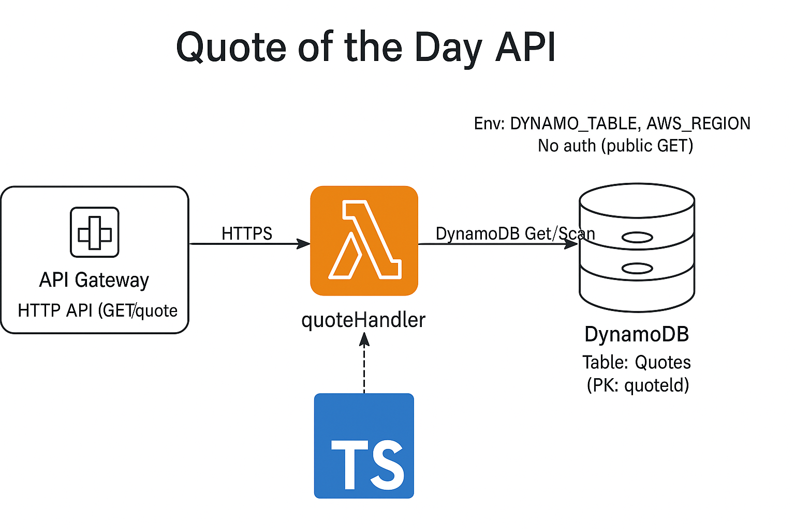

This project provides a serverless “Quote of the Day” API. An API Gateway endpoint triggers a TypeScript Lambda function, which retrieves a random quote from a DynamoDB table and returns it as JSON. The entire infrastructure—including the Lambda, API route, and database—is defined and deployed using AWS CDK, with optional scripts for creating and seeding the table during development.

